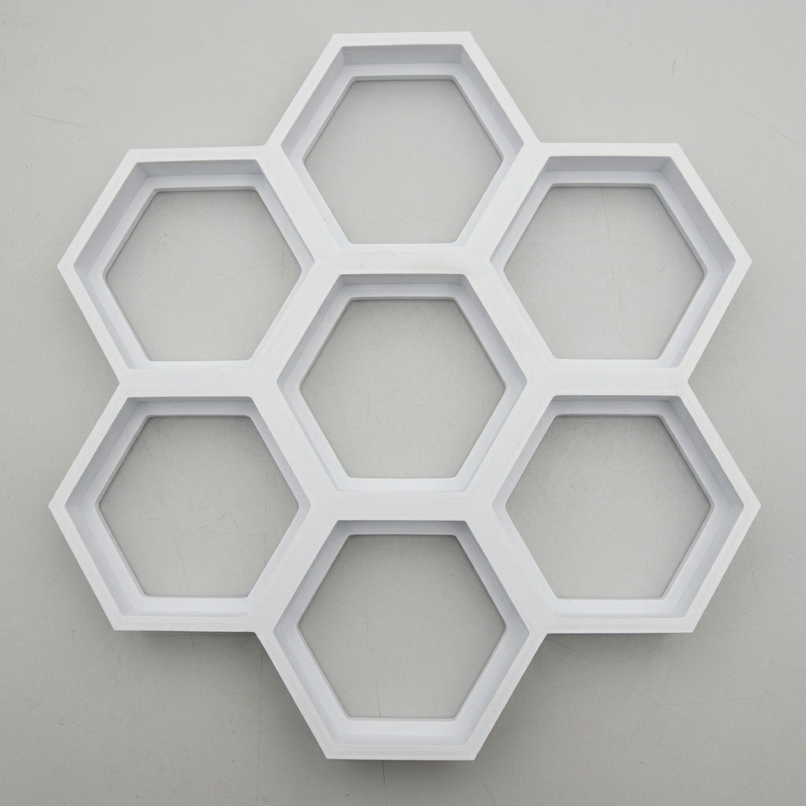
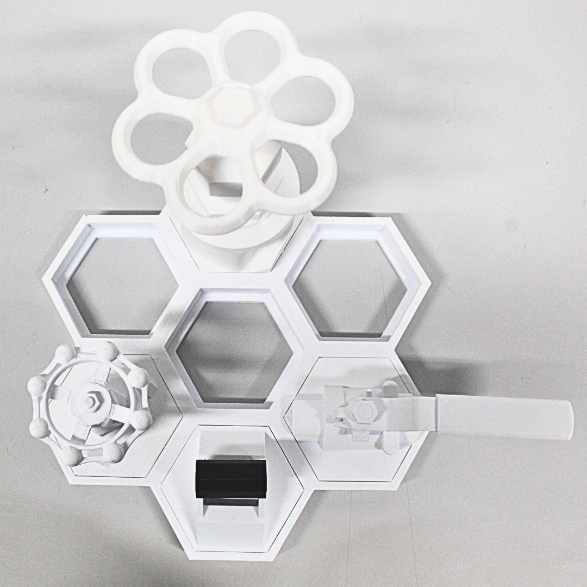
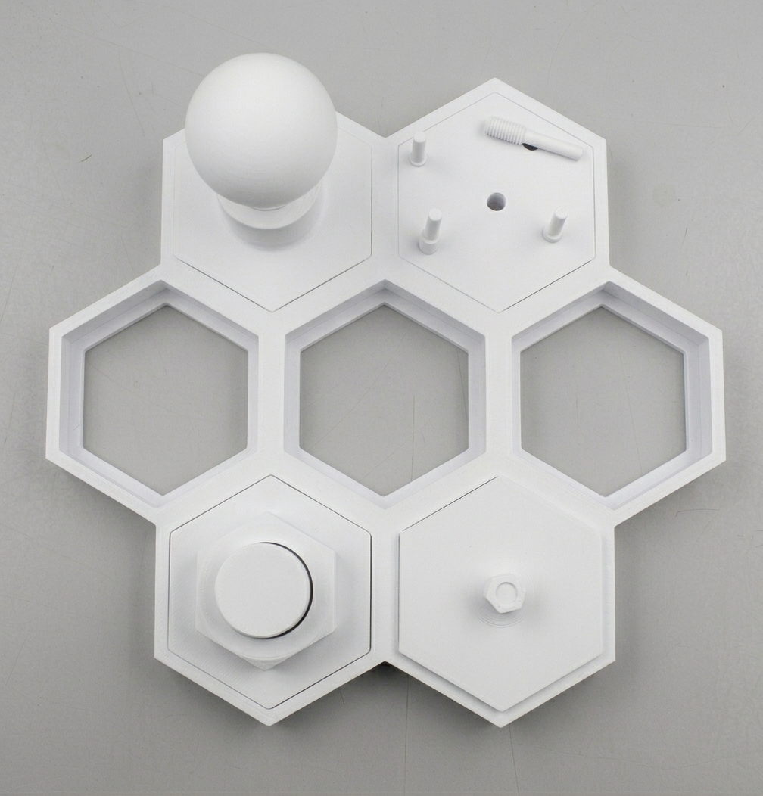
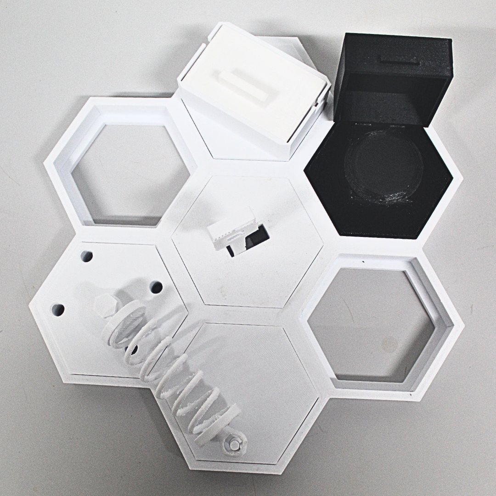

# HiveBoard – a Modular Dexterity Benchmark for Industrial Robotics

<p align="center">
    <picture>
  <source media="(prefers-color-scheme: dark)" srcset="Images/HIVEBOARD_logo_dark.png" width="50%">
  <source media="(prefers-color-scheme: light)" srcset="Images/HIVEBOARD_logo_light.png" width="50%">
  
    </picture>
</p>

## Overview

HiveBoard is an open, modular, and fully 3D-printable dexterity benchmark designed for evaluating industrial robotic manipulation systems. The project focuses on reproducibility, accessibility, and compatibility with both real-world robotic systems and simulation environments.

The platform is designed around three principles:

- **Low-cost reproducibility** using consumer-grade FDM 3D printers
- **Modular task expansion** through interchangeable attachments
- **Simulation-ready assets** for robotics research and sim-to-real workflows

The system consists of a **hexagonal honeycomb base** that accepts interchangeable attachments representing industrial manipulation tasks such as:

- Valves
- Circuit breakers
- Threaded fasteners
- Peg insertion
- Drawer manipulation
- Lock-and-key
- Shock absorber assemblies

All components in this repository are printable in **PLA filament**.

---

## Project Architecture

<p align="center">
    
</p>


The HiveBoard base contains seven hexagonal cells arranged in a honeycomb pattern. Each attachment uses a standardized press-fit mounting geometry, allowing rapid reconfiguration without screws or fasteners.

This modular architecture enables:

- Fast task swapping
- Difficulty scaling
- Multi-task robotic evaluations
- Easy extension with new attachments

---

## Attachment Categories

### 1. Torque-Based Tasks

<p align="center">
    
</p>

These tasks evaluate force control and rotational manipulation capabilities.

Included components:

| Attachment | Description |
|---|---|
| Ball Valve | Quarter-turn valve with a lever handle |
| Friction Rings | Snap-on rings (set of four) that increase rotational friction, and therefore torque resistance, on the ball valve |
| Gate Valve (Small) | Compact gate valve with a smaller handwheel |
| Gate Valve (Large) | Larger gate valve with a higher-leverage handwheel |
| Circuit Breaker | Toggle-style industrial breaker |

The friction-ring system gives multiple torque levels on the ball valve without printing additional valves. Each ring sets a different rotational friction.

---

### 2. Precision-Based Tasks

<p align="center">
    
</p>

These tasks focus on alignment, insertion, and fine manipulation.

Included components:

| Attachment | Description |
|---|---|
| Light Bulb Socket | Threaded bulb-and-socket assembly |
| Thread M8 | Small threaded fastener |
| Thread M30 | Large threaded fastener |
| Peg Insertion Plate | Tight-clearance peg alignment |

These attachments challenge grasp precision and fine alignment.

---

### 3. Composed Assembly Tasks

<p align="center">
    
</p>

These tasks involve multiple sequential manipulation stages.

Included components:

| Attachment | Description |
|---|---|
| Hidden Push Button | Hinged cover plus button press |
| Lock and Key | Insertion and rotational unlocking |
| Sliding Drawer | Linear motion manipulation |
| Shock Absorber | Multi-part assembly that occupies two adjacent cells |

The composed tasks allow evaluation of multi-stage manipulation behavior under stage-wise scoring.

---

## Included STL Components

| Category | Part |
|---|---|
| Base System | Hexagonal Honeycomb Base |
| Torque Tasks | Ball Valve |
| Torque Tasks | Friction Rings |
| Torque Tasks | Gate Valve, Small |
| Torque Tasks | Gate Valve, Large |
| Torque Tasks | Circuit Breaker |
| Precision Tasks | Light Bulb Socket |
| Precision Tasks | Thread M8 |
| Precision Tasks | Thread M30 |
| Precision Tasks | Peg Insertion Plate |
| Assembly Tasks | Hidden Button |
| Assembly Tasks | Lock and Key |
| Assembly Tasks | Sliding Drawer |
| Assembly Tasks | Shock Absorber |

---

## Recommended 3D Printing Settings

**Recommended Print Bed Size:** 300 × 300 mm.

The HiveBoard system was designed around consumer-grade FDM printers with a minimum build volume of 300 × 300 mm, allowing the complete honeycomb base and all attachments to be printed without splitting large structural parts. This ensures better dimensional accuracy, improved press-fit consistency between modules, and simpler assembly across different printers and laboratories.

### Standard PLA Profile

| Setting | Value |
|---|---|
| Material | PLA |
| Nozzle Diameter | 0.4 mm |
| Layer Height | 0.20 mm |
| Wall Count | 4 |
| Top Layers | 5 |
| Bottom Layers | 5 |
| Infill | 20–40% |
| Print Speed | 50 mm/s |
| Nozzle Temperature | 200–220°C |
| Bed Temperature | 50–60°C |
| Cooling Fan | 100% |
| Supports | Only where required |
| Adhesion Type | Skirt or Brim |

---

### Recommended Infill Per Part Type

| Part Type | Recommended Infill |
|---|---|
| Base Structure | 20% |
| Mechanical Parts | 25% |
| Torque Components | 30% |
| Threads | 25% |
| Decorative Covers | 15% |

---

### Suggested Print Orientation

| Component Type | Orientation |
|---|---|
| Threads / Screws | Vertical |
| Nuts | Flat |
| Valves | Handle Up |
| Drawer | Flat on largest face |
| Pegs | Vertical |
| Shock Absorber Parts | Sideways |

---

## Simulation Compatibility


The HiveBoard project also includes simulation-ready CAD assets suitable for:

- MuJoCo
- PyBullet
- Isaac Sim
- ROS-based simulators

The digital assets contain:

- Joint definitions
- Collision meshes
- Mass properties
- Revolute and prismatic joints
- URDF and USD exports

This enables direct sim-to-real robotics experimentation.

---

## Evaluation Protocol

A reproducible operator-driven protocol is provided for benchmarking grippers, hands, and policies on HiveBoard:

- [`PROTOCOL.md`](Documentation/PROTOCOL.md): the full protocol, including success criteria, per-attachment timeouts, and stage definitions for the composed assembly tasks.
- [`HOW_TO_FILL_TRIALS.md`](Documentation/HOW_TO_FILL_TRIALS.md): column-by-column instructions for the trial logging template.
- [`trials.csv`](Documentation/trials.csv) and [`trials.xlsx`](Documentation/trials.xlsx): pre-populated logging template with one row per trial (5 trials per attachment, 65 rows total). Use the xlsx for filling in (frozen header, dropdowns, color-coded categories); the CSV is provided for scripts.

The protocol prescribes 5 recorded trials per attachment per platform. Operators may control the manipulation system through a teleoperated arm or through a wearable interface or exoskeleton driving a gripper or hand directly. For each trial we record the outcome, completion time, attempts, regrasps, and, for the composed assembly tasks, the highest stage reached within the timeout.

---

## Research Applications

HiveBoard supports:

- Robotic manipulation benchmarking.
- Gripper and dexterous-hand evaluation.
- Teleoperation experiments.
- Wearable-interface and exoskeleton evaluation.
- Reinforcement learning.
- Vision-language-action model evaluation.
- Sim-to-real transfer research.
- Industrial robotics training datasets.

---

## Repository Structure

    /
    ├── STL/             # printable parts
    ├── CAD/             # source CAD files
    ├── Simulation/      # URDF and USD with articulated joints
    ├── Documentation/   # PROTOCOL.md, HOW_TO_FILL_TRIALS.md, trials.csv, trials.xlsx
    ├── Images/          # photographs and renders
    └── README.md

---

## Notes

- All parts are designed for consumer-grade FDM printers.
- PLA is the recommended material for reproducibility.
- Minor sanding can improve threaded part performance.
- Press-fit tolerances depend on printer calibration; print one cell of the base and one attachment first to verify the fit before committing to a full set.
- Functional parts benefit from slower print speeds.

---

## Citation

If you use HiveBoard in research or publications, please cite the project paper:

```
@inproceedings{hiveboard2026,
  title  = {HiveBoard: An Open, Modular, 3D-Printed Dexterity Benchmark for Industrial Robotic Manipulation},
  author = {<authors>},
  booktitle = {<journal>},
  year   = {2026}
}
```

---

## License

This project is intended for research, educational, and prototyping purposes.
