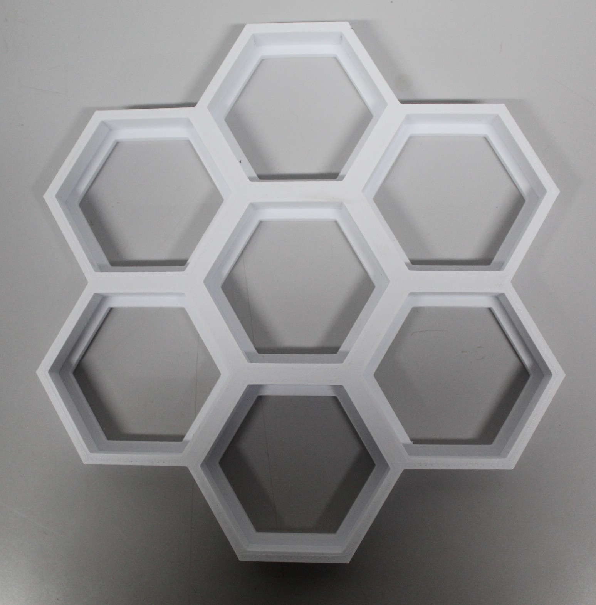
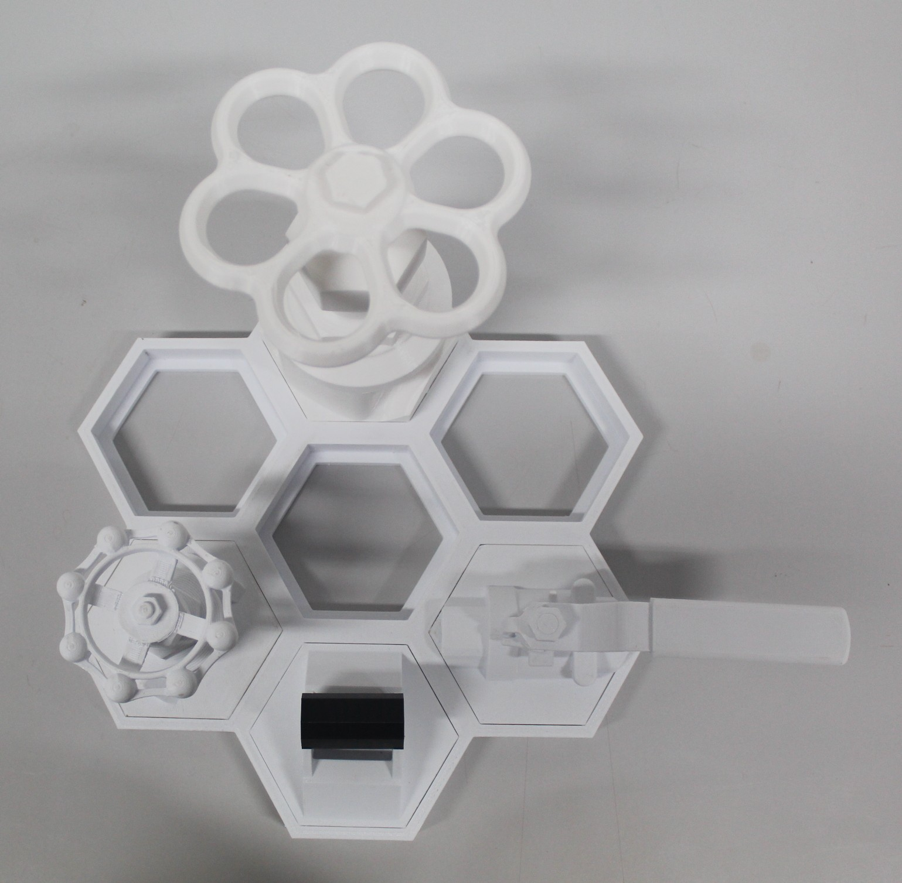
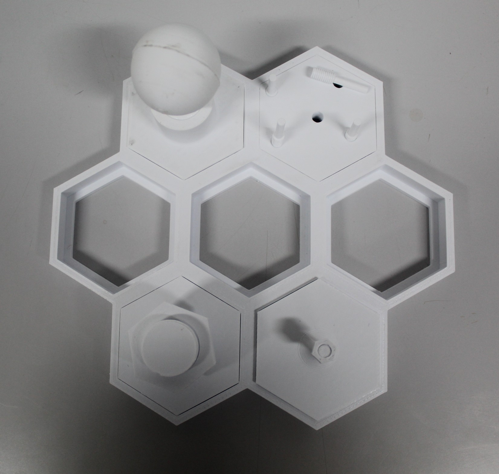
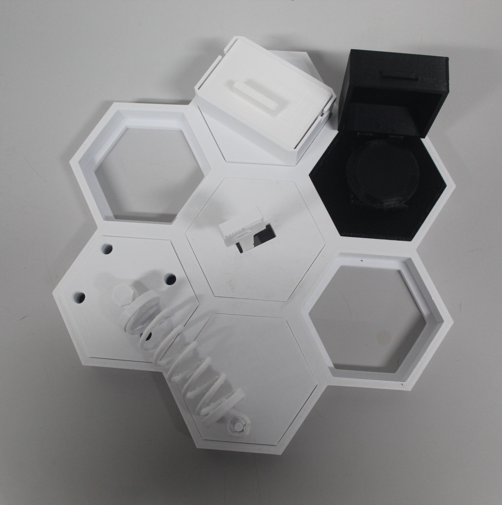

# HiveBoard – Modular Dexterity Benchmark for Industrial Robotics


## Overview

HiveBoard is an open, modular, and fully 3D-printable dexterity benchmark designed for evaluating industrial robotic manipulation systems. The project focuses on reproducibility, accessibility, and compatibility with both real-world robotic systems and simulation environments.

The platform was designed around three core principles:

- **Low-cost reproducibility** using consumer-grade FDM 3D printers
- **Modular task expansion** through interchangeable attachments
- **Simulation-ready assets** for robotics research and sim-to-real workflows

The system consists of a **hexagonal honeycomb base** that accepts interchangeable attachments representing industrial manipulation tasks such as:

- Valves
- Circuit breakers
- Threaded fasteners
- Peg insertion
- Drawer manipulation
- Lock-and-key systems
- Shock absorber assemblies

All components in this repository are printable in **PLA filament**.

---

# Project Architecture



The HiveBoard base contains seven hexagonal cells arranged in a honeycomb pattern. Each attachment uses a standardized press-fit mounting geometry, allowing rapid reconfiguration without screws or fasteners.

This modular architecture enables:

- Fast task swapping
- Difficulty scaling
- Multi-task robotic evaluations
- Easy extension with new attachments

---

# Attachment Categories

## 1. Torque-Based Tasks



These tasks evaluate force control and rotational manipulation capabilities.

Included components:

| Attachment | Description |
|---|---|
| Ball Valve | Rotational valve with configurable friction |
| Friction Rings | Snap-on rings that increase torque resistance |
| Gate Valve (Small) | Compact valve with lower torque |
| Gate Valve (Large) | Larger high-torque valve |
| Circuit Breaker | Toggle-style industrial breaker |

The friction ring system allows multiple torque levels without printing additional valves.

---

## 2. Precision-Based Tasks



These tasks focus on alignment, insertion, and fine manipulation.

Included components:

| Attachment | Description |
|---|---|
| Light Bulb Socket | Fine rotational alignment |
| Thread M8 | Small threaded fastener |
| Thread M30 | Large threaded fastener |
| Peg Insertion Plate | Tight-clearance peg alignment |

These attachments challenge grasp precision and fine force control.

---

## 3. Composed Assembly Tasks



These tasks involve multiple sequential manipulation stages.

Included components:

| Attachment | Description |
|---|---|
| Hidden Push Button | Hinged cover + button press |
| Lock and Key | Insertion and rotational unlocking |
| Sliding Drawer | Linear motion manipulation |
| Shock Absorber | Multi-part assembly spanning two cells |

The composed tasks allow evaluation of multi-stage manipulation behavior.

---

# Included STL Components

| Category | Part |
|---|---|
| Base System | Hexagonal Honeycomb Base |
| Torque Tasks | Ball Valve |
| Torque Tasks | Friction Rings |
| Torque Tasks | Gate Valve Small |
| Torque Tasks | Gate Valve Large |
| Torque Tasks | Circuit Breaker |
| Precision Tasks | Light Bulb Socket |
| Precision Tasks | Thread M8 |
| Precision Tasks | Thread M30 |
| Precision Tasks | Peg Insertion Plate |
| Assembly Tasks | Hidden Button |
| Assembly Tasks | Lock and Key |
| Assembly Tasks | Sliding Drawer |
| Assembly Tasks | Shock Absorber |

---

# Recommended 3D Printing Settings

## Standard PLA Profile

| Setting | Value |
|---|---|
| Material | PLA |
| Nozzle Diameter | 0.4 mm |
| Layer Height | 0.20 mm |
| Wall Count | 4 |
| Top Layers | 5 |
| Bottom Layers | 5 |
| Infill | 20–40% |
| Print Speed | 50 mm/s |
| Nozzle Temperature | 200–220°C |
| Bed Temperature | 50–60°C |
| Cooling Fan | 100% |
| Supports | Only where required |
| Adhesion Type | Skirt or Brim |

---

# Recommended Infill Per Part Type

| Part Type | Recommended Infill |
|---|---|
| Base Structure | 20% |
| Mechanical Parts | 25% |
| Torque Components | 30% |
| Threads | 25% |
| Decorative Covers | 15% |

---

# Suggested Print Orientation

| Component Type | Orientation |
|---|---|
| Threads / Screws | Vertical |
| Nuts | Flat |
| Valves | Handle Up |
| Drawer | Flat on largest face |
| Pegs | Vertical |
| Shock Absorber Parts | Sideways |

---

# Simulation Compatibility


The HiveBoard project also includes simulation-ready CAD assets suitable for:

- MuJoCo
- PyBullet
- Isaac Sim
- ROS-based simulators

The digital assets contain:

- Joint definitions
- Collision meshes
- Mass properties
- Revolute and prismatic joints
- URDF and USD exports

This enables direct sim-to-real robotics experimentation.

---

# Research Applications

HiveBoard can be used for:

- Robotic manipulation benchmarking
- Gripper evaluation
- Teleoperation experiments
- Reinforcement learning
- Vision-language-action model evaluation
- Sim-to-real transfer research
- Industrial robotics training datasets

---

# Repository Structure

```text
/
├── STL/
├── CAD/
├── Simulation/
├── Documentation/
├── Images/
└── README.md
```

---

# Example HiveBoard Layout


Example configurations may combine:

- Torque tasks on outer cells
- Precision tasks in the center
- Multi-cell assembly tasks spanning adjacent cells

This allows the creation of custom benchmark scenarios.

---

# Notes

- All parts are designed for consumer-grade FDM printers
- PLA is the recommended material for reproducibility
- Minor sanding may improve threaded part performance
- Press-fit tolerances may vary depending on printer calibration
- Functional parts benefit from slower print speeds

---

# Citation

If you use HiveBoard in research or publications, please cite the original project paper.

---

# License

This project is intended for research, educational, and prototyping purposes.
